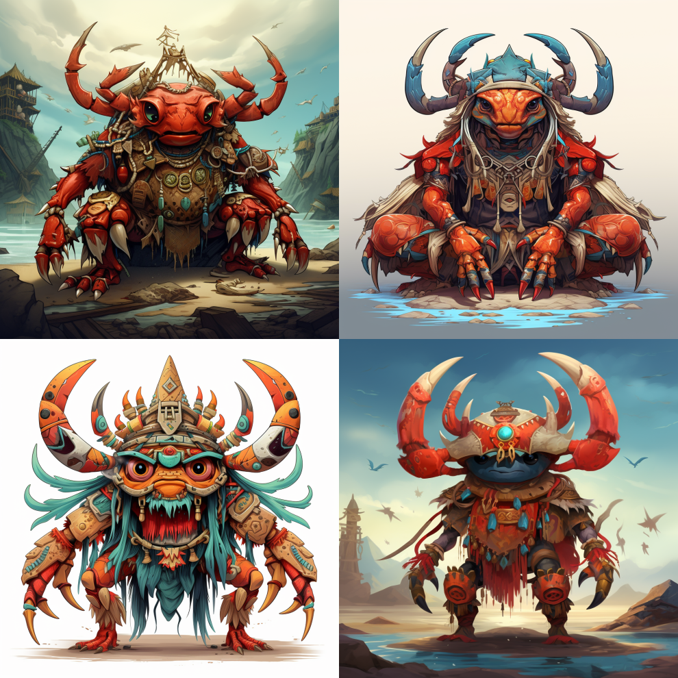
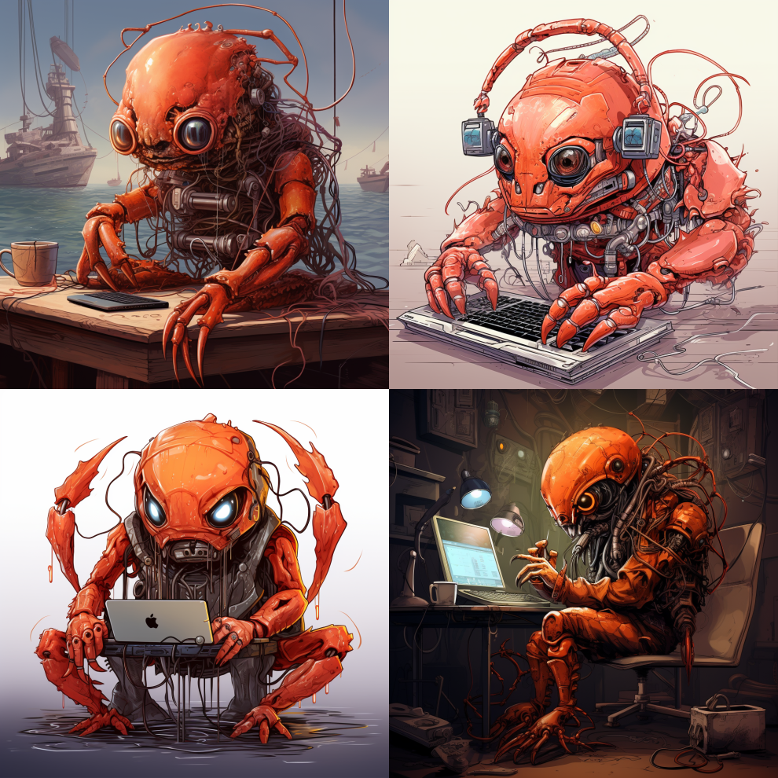
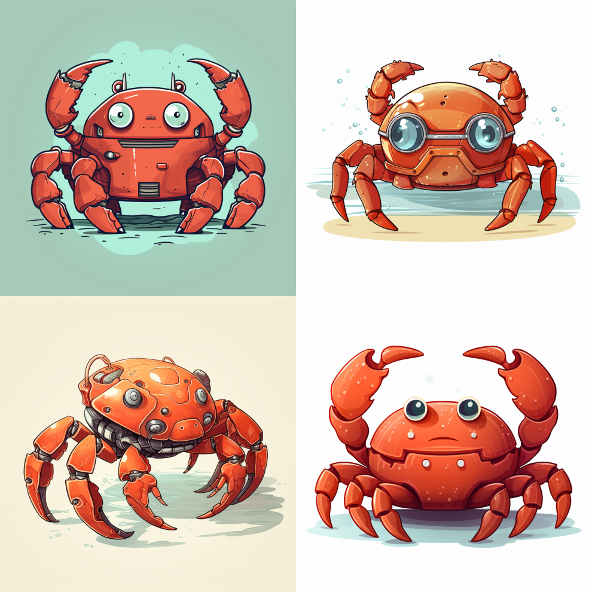

Images generated using Midjourney.

("a crab shaman in cartoon style")

("rust mascot, a cartoon crab, with cybernetic parts, connected through a cable
to a boy's head while he types at a computer, cyberpunk style")

("cartoon crab representing the Rust programming language")

